# 🔷 NodeSnap

**🌍 Langue :** **🇫🇷 Français** · [🇬🇧 English](README.en.md)

🛡️ Outil de sauvegarde de configurations d'équipements réseau multi-vendor. 📸 Stocke les snapshots en SQLite, détecte les changements, et expose une 🌐 interface web ainsi qu'une 🔌 API REST.

## 📸 Aperçu

> Interface disponible en **5 thèmes** : Dark, Light, Dracula, Tokyo Night, Cyberpunk — sélection via le menu déroulant dans la barre de navigation.

### Dashboard

<table>
<tr>
<td align="center"><b>🌑 Dark</b></td>
<td align="center"><b>☀️ Light</b></td>
</tr>
<tr>
<td>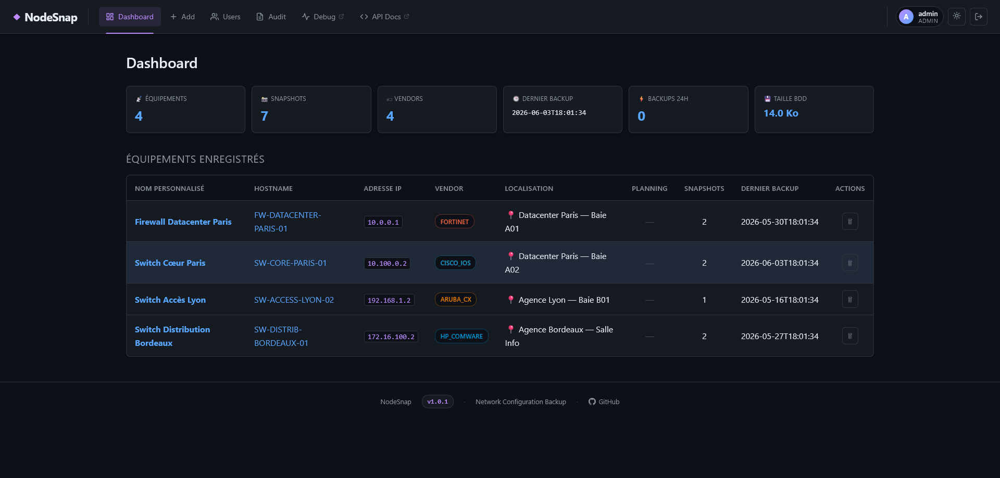</td>
<td>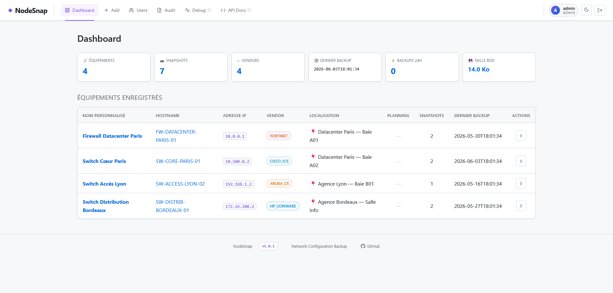</td>
</tr>
</table>

Vue d'ensemble : compteurs (équipements, snapshots, vendors, taille BDD), tableau des équipements enregistrés avec vendor, localisation, planning et dernier backup.

---

### Ajout / Scan d'un équipement

<table>
<tr>
<td align="center"><b>🌑 Dark</b></td>
<td align="center"><b>☀️ Light</b></td>
</tr>
<tr>
<td>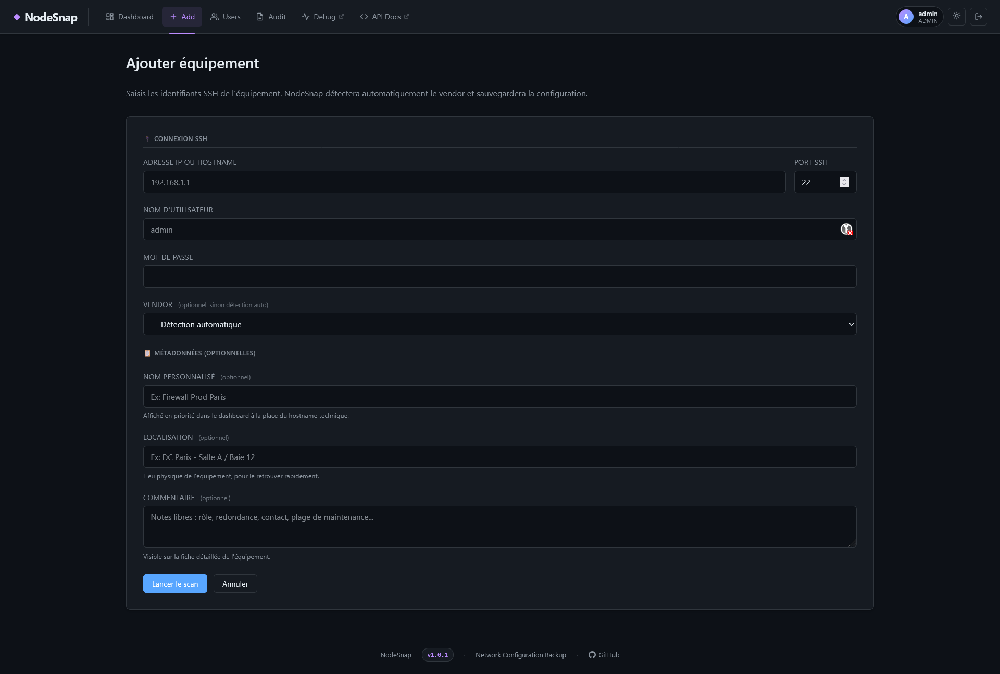</td>
<td>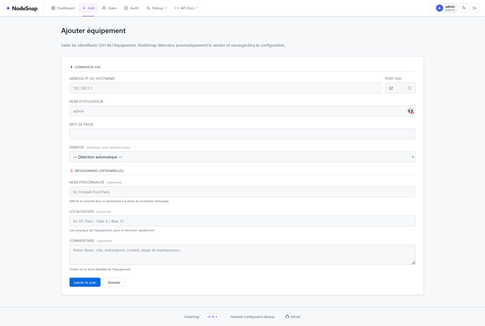</td>
</tr>
</table>

Formulaire de scan SSH avec détection automatique du vendor, métadonnées optionnelles (nom personnalisé, localisation, commentaire).

---

### Fiche équipement & Planification

<table>
<tr>
<td align="center"><b>🌑 Dark</b></td>
<td align="center"><b>☀️ Light</b></td>
</tr>
<tr>
<td>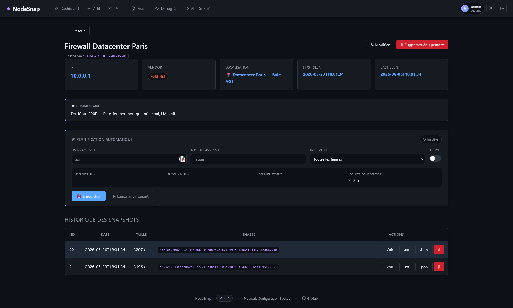</td>
<td>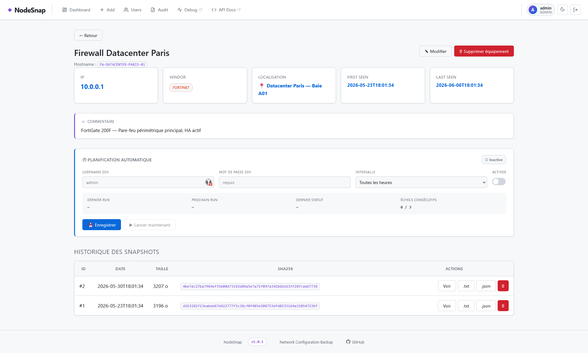</td>
</tr>
</table>

Détail d'un équipement : informations, commentaire, planification automatique (credentials, intervalle, statut) et historique des snapshots avec SHA-256.

---

### Visualisation de configuration

<table>
<tr>
<td align="center"><b>🌑 Dark</b></td>
<td align="center"><b>☀️ Light</b></td>
</tr>
<tr>
<td>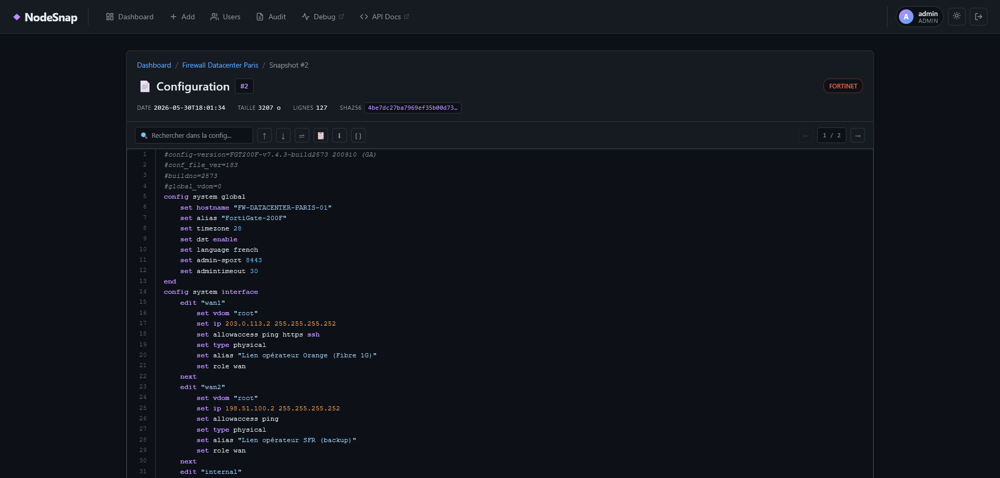</td>
<td>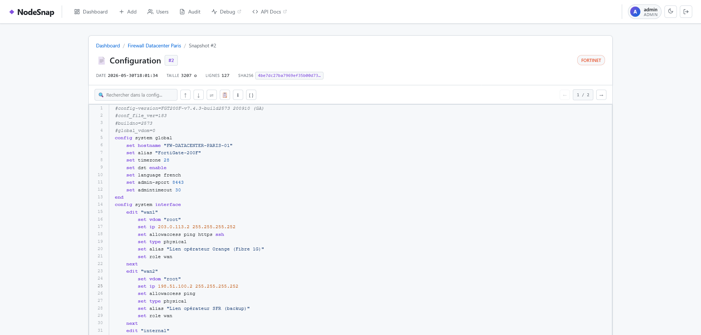</td>
</tr>
</table>

Visionneuse de snapshot avec coloration syntaxique, recherche en texte intégral, navigation entre snapshots et export `.txt` / `.json`.

---

### Journal d'audit

<table>
<tr>
<td align="center"><b>🌑 Dark</b></td>
<td align="center"><b>☀️ Light</b></td>
</tr>
<tr>
<td>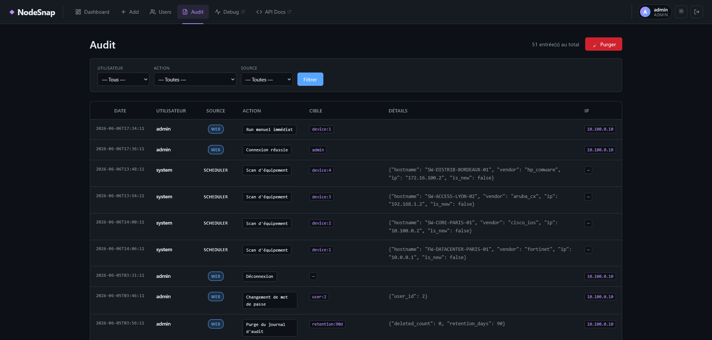</td>
<td>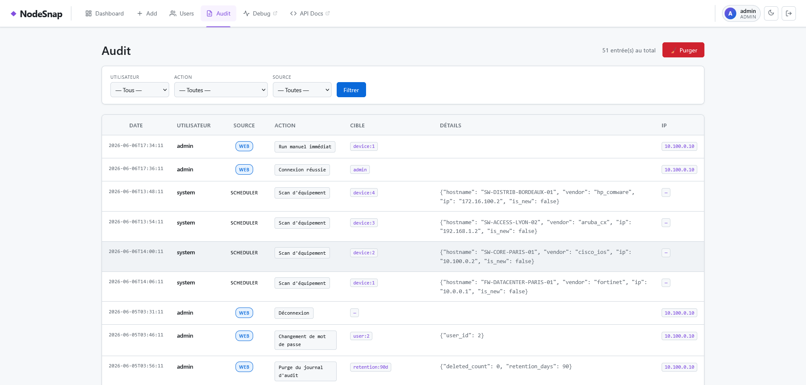</td>
</tr>
</table>

Traçabilité complète : connexions, scans manuels et automatiques, modifications, suppressions — filtrable par utilisateur, action et source (web / scheduler).

---

### Gestion des utilisateurs

<table>
<tr>
<td align="center"><b>🌑 Dark</b></td>
<td align="center"><b>☀️ Light</b></td>
</tr>
<tr>
<td>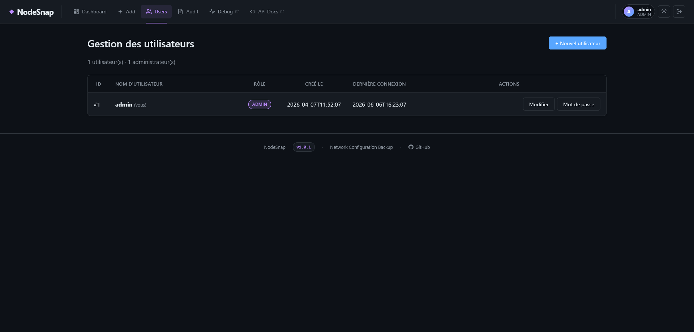</td>
<td>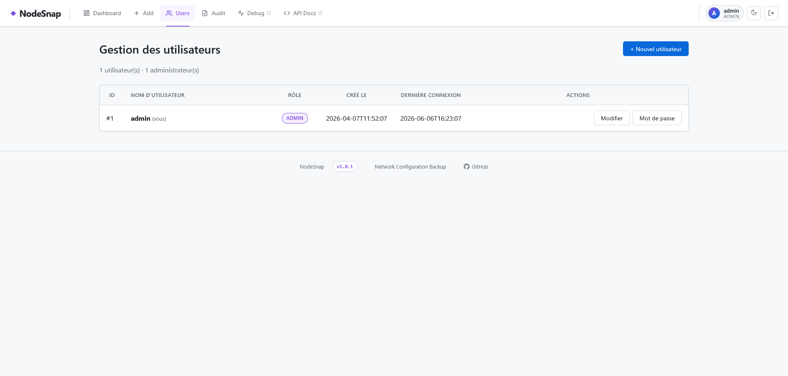</td>
</tr>
</table>

Gestion multi-utilisateurs avec rôles admin / user, création, modification et changement de mot de passe.

---

### Documentation API

<table>
<tr>
<td align="center"><b>☀️ Light</b></td>
</tr>
<tr>
<td>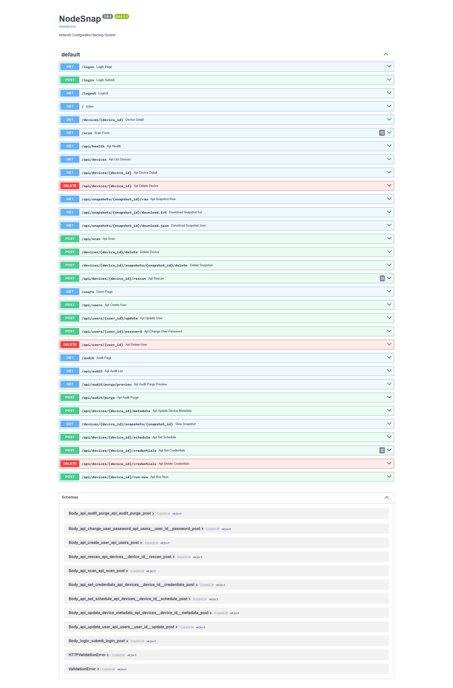</td>
</tr>
</table>

Documentation Swagger interactive accessible sur `/api/docs` — tous les endpoints REST sont explorables et testables directement.

---

## 🗂️ Arborescence

```
NodeSnap/
├── nodesnap.py              # CLI — backup manuel d'un équipement
├── version.py               # Version de l'application (source de vérité)
├── requirements.txt
├── .env.example             # Template de configuration (sans secrets)
│
├── api/                     # Interface web & API REST (FastAPI)
│   ├── main.py              # Initialisation de l'app, middlewares
│   ├── routes.py            # Endpoints HTML et JSON
│   ├── i18n.py              # Module d'internationalisation (FR / EN)
│   └── templates/           # Templates Jinja2
│       ├── base.html        # Layout commun (header, footer, thème)
│       ├── index.html       # Dashboard — liste des équipements
│       ├── device.html      # Détail d'un équipement + snapshots
│       ├── snapshot_view.html
│       ├── scan.html        # Formulaire de scan
│       ├── audit.html       # Journal d'audit
│       ├── users.html       # Gestion des utilisateurs
│       └── login.html
│
├── core/
│   └── detector.py          # Détection automatique du vendor via SSH
│
├── collectors/
│   └── fetcher.py           # Récupération de la config par vendor
│
├── storage/
│   ├── database.py          # SQLite — équipements & snapshots
│   ├── credentials.py       # Credentials chiffrés AES-256-GCM
│   ├── users.py             # Utilisateurs & authentification (bcrypt)
│   └── audit.py             # Journal d'audit
│
├── services/
│   └── scheduler.py         # Worker de backups automatiques (threading)
│
├── deploy/
│   ├── install.sh           # Script d'installation automatisé
│   └── nodesnap-web.service # Template du service systemd
│
├── i18n/                    # Fichiers de traduction
│   ├── fr.json
│   └── en.json
│
├── CHANGELOG.md             # Historique des versions
└── README.md
```

## ✨ Fonctionnalités

- 🔍 Détection automatique du vendor via SSH (Netmiko)
- 🌐 **32 vendors supportés** end-to-end (détection + backup + hostname) :
  - **Cisco** : IOS, IOS-XE, IOS-XR, NX-OS, ASA, Small Business (SG/SF 200/300/350/500/550)
  - **HPE / Aruba** : Aruba CX, Aruba ProCurve, HP Comware
  - **Firewalls** : Fortinet, Palo Alto, Checkpoint, SonicWall, WatchGuard, Stormshield
  - **Juniper** (Junos), **Arista** (EOS)
  - **Dell** : OS10, OS6, Force10, PowerConnect
  - **Huawei** (VRP), **Mikrotik** (RouterOS), **Extreme** (EXOS), **Allied Telesis** (AlliedWare Plus)
  - **VyOS**, **Ubiquiti** (EdgeRouter/EdgeSwitch + UniFi Switch)
  - **Nokia SR OS** (ex-Alcatel-Lucent), **Ruckus** (FastIron/ICX)
  - **F5 BIG-IP** (tmsh), **pfSense**, **OPNsense**, **Linux générique**
- 🗄️ Stockage SQLite avec déduplication par SHA-256
- 🖥️ Interface web (FastAPI + Jinja2) : dashboard, scan, visualisation de snapshots
- 🎨 5 thèmes (Dark, Light, Dracula, Tokyo Night, Cyberpunk) avec mémorisation par cookie
- ⏱️ Scheduler de backups automatiques avec gestion des échecs
- 🔐 Credentials chiffrés AES-256-GCM
- 📋 Journal d'audit complet
- 👥 Gestion multi-utilisateurs avec rôles (admin = écriture, user = lecture seule)
- 🛡️ Protection CSRF, rate limit du login, headers HTTP de sécurité (CSP, X-Frame-Options…)
- 🌍 Interface multilingue (Français / English) avec switch en un clic

## ⚙️ Installation

```bash
python3 -m venv .venv
source .venv/bin/activate            # bash / zsh
# source .venv/bin/activate.fish     # fish shell
# source .venv/bin/activate.csh      # csh / tcsh
pip install -r requirements.txt
```

> 💡 Sous **fish** ou **csh**, utilise la variante adaptée (`activate.fish` ou `activate.csh`) — sinon le shell renvoie une erreur de parsing sur `VIRTUAL_ENV=…`.

## 🔧 Configuration

```bash
cp .env.example .env
sed -i "s|SESSION_SECRET=changeme|SESSION_SECRET=$(python3 -c 'import secrets; print(secrets.token_urlsafe(48))')|" .env
```

La 2ᵉ commande génère une `SESSION_SECRET` aléatoire et l'injecte directement dans le `.env`.

Variables disponibles dans `.env` :

| Variable | Description |
|---|---|
| `SESSION_SECRET` | Clé de signature des sessions web (obligatoire en prod) |
| `NODESNAP_MASTER_KEY` | Clé AES-256 pour les credentials (générée automatiquement si absente) |
| `TRUSTED_PROXY` | Mettre à `1` si l'app est derrière un reverse-proxy (active X-Forwarded-For) |
| `HTTPS_ONLY` | Mettre à `1` quand l'app est servie en HTTPS — marque le cookie de session `Secure` |

## 🚀 Utilisation

### Interface web

```bash
uvicorn api.main:app --host 0.0.0.0 --port 8000
```

Créer le premier utilisateur admin (le mot de passe est demandé en interactif) :

```bash
python -m storage.users create <username> admin
```

### 🌍 Langues

L'interface est traduite en **français** et **anglais**. Bascule en un clic via le bouton `FR` / `EN` dans la barre de navigation, ou depuis la page de connexion. La préférence est mémorisée dans un cookie `nodesnap_lang` (durée 1 an).

Pour ajouter ou corriger une traduction, éditer `i18n/fr.json` ou `i18n/en.json` puis redémarrer le service (les fichiers sont chargés au boot).

### 🔐 Rôles

| Rôle | Lecture (dashboard, snapshots, configs) | Écriture (scan, suppression, planification, users, audit) |
|---|:---:|:---:|
| `admin` | ✅ | ✅ |
| `user` | ✅ | ❌ |

### ⏱️ Backups automatiques

NodeSnap intègre un scheduler qui tourne en arrière-plan et déclenche automatiquement les backups selon un intervalle configuré par équipement.

**Configuration via l'interface web (page de détail d'un équipement) :**

1. Stocker les credentials SSH de l'équipement *(onglet Planification)*
2. Activer la planification et définir l'intervalle en minutes
3. Optionnel : déclencher un run immédiat avec le bouton **Run maintenant**

**Comportement :**
- Le scheduler vérifie les équipements à scanner toutes les **60 secondes**
- Un snapshot n'est créé que si la configuration a **changé** depuis le dernier backup (déduplication SHA-256)
- Après **3 échecs consécutifs**, la planification est automatiquement désactivée et une entrée d'audit est créée
- Maximum **5 scans en parallèle** simultanément

### CLI (scan ponctuel)

```
Usage : ./nodesnap.py <host> <user> [password] [options]
```

| Paramètre | Type | Défaut | Description |
|-----------|------|--------|-------------|
| `host` | positional | — | IP ou hostname de l'équipement |
| `user` | positional | — | Nom d'utilisateur SSH |
| `password` | positional optionnel | prompt | Mot de passe SSH (voir modes ci-dessous) |
| `--vendor` | option | autodétection | Forcer le type d'équipement |
| `--port` | option | `22` | Port SSH |
| `--output` | option | `./backups` | Répertoire de sauvegarde des fichiers `.cfg` |
| `--common-name` | option | — | Nom affiché dans l'interface (ex : "Firewall Prod Paris") |
| `--location` | option | — | Localisation physique (ex : "DC Paris - Rack 12") |
| `--comment` | option | — | Note libre visible sur la fiche équipement |
| `-v` / `--verbose` | flag | — | Activer les logs DEBUG |

**3 méthodes pour fournir le mot de passe (par ordre de priorité) :**

```bash
# 1. Prompt interactif masqué (recommandé — ne laisse rien dans l'historique)
./nodesnap.py 192.168.1.1 admin

# 2. Variable d'environnement (adapté aux scripts)
NODESNAP_PASSWORD='monpass' ./nodesnap.py 192.168.1.1 admin

# 3. Argument direct (déconseillé — visible dans l'historique shell)
./nodesnap.py 192.168.1.1 admin monpass
```

**Exemples :**

```bash
# Scan minimal — vendor autodétecté, mot de passe demandé à l'écran
./nodesnap.py 192.168.1.1 admin

# Avec nom personnalisé (affiché dans le tableau de bord à la place du hostname)
./nodesnap.py 192.168.1.1 admin --common-name "Switch cœur Lyon"

# Avec toutes les métadonnées
./nodesnap.py 192.168.1.1 admin \
    --common-name "Firewall Prod Paris" \
    --location "DC Paris - Salle A / Rack 12" \
    --comment "FW de prod HA avec FW02. Maintenance le 1er mardi du mois."

# Forcer le vendor (évite la phase d'autodétection)
./nodesnap.py 192.168.1.1 admin --vendor fortinet
./nodesnap.py 192.168.1.1 admin --vendor cisco_ios
./nodesnap.py 192.168.1.1 admin --vendor ubiquiti_edge

# Port SSH non standard
./nodesnap.py 192.168.1.1 admin --port 2222

# Répertoire de sortie personnalisé pour les fichiers .cfg
./nodesnap.py 192.168.1.1 admin --output /mnt/nas/backups/reseau

# Mode verbose (logs DEBUG — utile pour diagnostiquer une connexion SSH)
./nodesnap.py 192.168.1.1 admin -v

# Utilisation dans un script automatisé (toutes options combinées)
NODESNAP_PASSWORD="$SECRET" ./nodesnap.py 10.0.0.254 admin \
    --vendor paloalto --port 22 \
    --common-name "FW DMZ" \
    --location "Salle serveurs" \
    --output /opt/backups
```

**Vendors supportés :**

```
Firewalls    : fortinet, paloalto, cisco_asa, checkpoint, sonicwall,
               watchguard, stormshield
Cisco        : cisco_ios, cisco_xe, cisco_xr, cisco_nxos, cisco_s300
HPE/Aruba    : aruba_cx, aruba_procurve, hp_comware
Autres       : juniper, arista, huawei, mikrotik, extreme_exos,
               alliedtelesis, vyos, nokia_sros, ruckus
Ubiquiti     : ubiquiti_edge, ubiquiti_unifi
F5 / Linux   : f5_tmsh, linux
Firewalls BSD: pfsense, opnsense
Dell         : dell_os10, dell_os6, dell_force10, dell_powerconnect
```

> Les métadonnées (`--common-name`, `--location`, `--comment`) sont **préservées** lors d'un rescan si elles ne sont pas repassées en paramètre.

## 🖥️ Déploiement (service systemd)

Après avoir cloné le repo, un seul script installe tout :

```bash
sudo bash deploy/install.sh
```

Le script s'occupe de :
- Créer le venv et installer les dépendances
- Générer le fichier `.env` avec une `SESSION_SECRET` aléatoire
- Créer les dossiers `backups/` et `logs/`
- Installer et démarrer le service systemd `nodesnap-web`
- Ajouter l'alias `nodesnap-env` dans le shell
- Créer le premier compte administrateur (interactif)

> Le service se relance automatiquement au redémarrage du serveur.

## 🛠️ Commandes utiles (production)

```bash
nodesnap-env                          # Activer le venv Python

sudo systemctl status nodesnap-web    # État du service web
sudo systemctl start nodesnap-web     # Démarrer le service web
sudo systemctl stop nodesnap-web      # Arrêter le service web
sudo systemctl restart nodesnap-web   # Redémarrer le service web

journalctl -u nodesnap-web -f                  # Logs en temps réel
journalctl -u nodesnap-web -n 100 -f          # 100 dernières lignes + suivi
journalctl -u nodesnap-web --since today -f   # Logs depuis aujourd'hui
journalctl -u nodesnap-web -p err -f          # Erreurs uniquement

./nodesnap.py <ip> <user> [options]   # Backup manuel (voir section CLI ci-dessus)
```

## 🏷️ Versioning

La version courante est définie dans [`version.py`](version.py) et affichée dans le footer de l'interface web.  
Voir [CHANGELOG.md](CHANGELOG.md) pour l'historique des versions.

Pour bumper la version avant un tag Git :

```bash
# Éditer version.py, puis :
git add version.py
git commit -m "bump: v1.1.0"
git tag v1.1.0
git push --follow-tags
```

> ⚠️ Après chaque bump, redémarrer le service pour que l'interface reflète la nouvelle version :
> ```bash
> sudo systemctl restart nodesnap-web
> ```

## 📄 Licence

MIT
